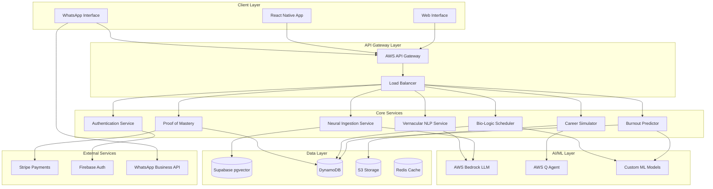

# Design Document: PathPilot Bharat

## Overview

PathPilot Bharat is a cybernetic learning operating system architected as a distributed, AI-powered platform optimized for the Indian educational ecosystem. The system combines advanced machine learning, natural language processing, and behavioral analytics to deliver personalized education through accessible interfaces like WhatsApp, while maintaining high performance on resource-constrained devices and networks.

The architecture follows a microservices pattern with edge computing capabilities, ensuring low latency and offline functionality for students across India's diverse connectivity landscape.

## Architecture

### High-Level Architecture



### Network Optimization Architecture

```mermaid
graph LR
    subgraph "Edge Layer"
        CDN[CloudFront CDN]
        EDGE[Lambda@Edge]
    end
    
    subgraph "Compression Layer"
        GZIP[GZIP Compression]
        BROTLI[Brotli Compression]
        IMG[Image Optimization]
    end
    
    subgraph "Caching Strategy"
        L1[Browser Cache]
        L2[CDN Cache]
        L3[Redis Cache]
        L4[Database Cache]
    end
    
    CLIENT[2G Client] --> CDN
    CDN --> EDGE
    EDGE --> GZIP
    GZIP --> L1
    L1 --> L2
    L2 --> L3
    L3 --> L4
```

## Components and Interfaces

### 1. Neural Ingestion Service

**Purpose**: Converts educational content (PDFs, images, URLs) into structured knowledge graphs.

**Key Components**:
- **Document Parser**: Handles PDF text extraction using AWS Textract
- **OCR Engine**: Processes photographed content with 95% accuracy
- **Web Scraper**: Extracts content from educational URLs
- **Knowledge Graph Builder**: Creates interconnected concept maps
- **Language Detector**: Identifies content language for proper processing

**Interfaces**:
```typescript
interface NeuralIngestionService {
  parsePDF(file: Buffer): Promise<KnowledgeGraph>
  processImage(image: Buffer): Promise<KnowledgeGraph>
  scrapeURL(url: string): Promise<KnowledgeGraph>
  validateGraph(graph: KnowledgeGraph): Promise<ValidationResult>
}

interface KnowledgeGraph {
  id: string
  concepts: Concept[]
  relationships: Relationship[]
  metadata: GraphMetadata
}
```

### 2. Bio-Logic Scheduler

**Purpose**: Optimizes study schedules based on individual circadian rhythms and performance data.

**Key Components**:
- **Circadian Analyzer**: Tracks energy patterns and optimal learning windows
- **Performance Correlator**: Links study times with retention rates
- **Schedule Optimizer**: Uses genetic algorithms for optimal time allocation
- **Adaptive Engine**: Continuously refines schedules based on feedback

**Interfaces**:
```typescript
interface BioLogicScheduler {
  generateSchedule(studentId: string, preferences: StudyPreferences): Promise<Schedule>
  adaptSchedule(studentId: string, performanceData: PerformanceMetrics[]): Promise<Schedule>
  getOptimalStudyTime(studentId: string, subject: string): Promise<TimeWindow>
}

interface Schedule {
  studentId: string
  timeBlocks: TimeBlock[]
  restPeriods: RestPeriod[]
  adaptationScore: number
}
```

### 3. Burnout Prediction Engine

**Purpose**: Predicts student burnout 48 hours in advance using behavioral and performance indicators.

**Key Components**:
- **Data Collector**: Gathers study duration, sleep patterns, performance metrics
- **Pattern Analyzer**: Identifies stress indicators and declining performance
- **Prediction Model**: ML model trained on historical burnout cases
- **Intervention Recommender**: Suggests specific recovery strategies

**Interfaces**:
```typescript
interface BurnoutPredictor {
  analyzeBurnoutRisk(studentId: string): Promise<BurnoutAssessment>
  predictBurnout(studentId: string, timeHorizon: number): Promise<BurnoutPrediction>
  recommendInterventions(assessment: BurnoutAssessment): Promise<Intervention[]>
}

interface BurnoutAssessment {
  riskLevel: 'LOW' | 'MEDIUM' | 'HIGH' | 'CRITICAL'
  confidence: number
  indicators: BurnoutIndicator[]
  timeToBreakdown: number // hours
}
```

### 4. Career Simulator

**Purpose**: Provides immersive "day in the life" experiences for 50+ career paths.

**Key Components**:
- **Scenario Generator**: Creates realistic career scenarios using AWS Q
- **Personalization Engine**: Adapts scenarios to student background
- **Market Data Integrator**: Updates career information quarterly
- **Assessment Engine**: Evaluates career fit based on simulation performance

**Interfaces**:
```typescript
interface CareerSimulator {
  generateScenario(career: string, studentProfile: StudentProfile): Promise<CareerScenario>
  simulateDay(scenarioId: string, decisions: Decision[]): Promise<SimulationResult>
  assessCareerFit(studentId: string, career: string): Promise<CareerFitScore>
  getCareerRecommendations(studentId: string): Promise<CareerRecommendation[]>
}

interface CareerScenario {
  id: string
  career: string
  scenarios: DayScenario[]
  learningObjectives: string[]
  assessmentCriteria: AssessmentCriteria[]
}
```

### 5. WhatsApp Interface Service

**Purpose**: Provides full system functionality through WhatsApp chat interface.

**Key Components**:
- **Message Router**: Directs messages to appropriate services
- **Context Manager**: Maintains conversation state across sessions
- **Response Formatter**: Optimizes responses for WhatsApp constraints
- **Media Handler**: Processes images, documents, and audio files

**Interfaces**:
```typescript
interface WhatsAppInterface {
  processMessage(message: WhatsAppMessage): Promise<WhatsAppResponse>
  handleMediaUpload(media: MediaFile): Promise<ProcessingResult>
  maintainContext(userId: string, context: ConversationContext): Promise<void>
  formatResponse(data: any, format: ResponseFormat): Promise<WhatsAppResponse>
}

interface WhatsAppMessage {
  from: string
  body: string
  type: 'text' | 'image' | 'document' | 'audio'
  media?: MediaFile
  timestamp: Date
}
```

### 6. Vernacular AI Service

**Purpose**: Provides natural language understanding and generation in Indian languages.

**Key Components**:
- **Language Detector**: Identifies input language and code-mixing
- **Translation Engine**: Handles cross-language communication
- **Context Preservor**: Maintains meaning across language switches
- **Cultural Adapter**: Adjusts responses for cultural context

**Interfaces**:
```typescript
interface VernacularAI {
  detectLanguage(text: string): Promise<LanguageDetection>
  translateWithContext(text: string, targetLang: string, context: Context): Promise<Translation>
  generateResponse(prompt: string, language: string): Promise<AIResponse>
  handleCodeMixing(text: string): Promise<ProcessedText>
}

interface LanguageDetection {
  primaryLanguage: string
  confidence: number
  codeMixing: boolean
  mixedLanguages?: string[]
}
```

## Data Models

### Core Entities

```typescript
// Student Profile
interface Student {
  id: string
  name: string
  email: string
  phone: string
  preferredLanguages: string[]
  educationLevel: string
  subjects: string[]
  circadianProfile: CircadianProfile
  performanceHistory: PerformanceMetric[]
  createdAt: Date
  updatedAt: Date
}

// Knowledge Graph Structure
interface KnowledgeGraph {
  id: string
  studentId: string
  source: 'PDF' | 'IMAGE' | 'URL' | 'MANUAL'
  concepts: Concept[]
  relationships: Relationship[]
  metadata: {
    subject: string
    difficulty: number
    estimatedHours: number
    language: string
  }
}

interface Concept {
  id: string
  name: string
  description: string
  difficulty: number
  prerequisites: string[]
  masteryLevel: number
  timeToMaster: number
}

// Bio-Logic Schedule
interface Schedule {
  id: string
  studentId: string
  date: Date
  timeBlocks: TimeBlock[]
  adaptationScore: number
  adherenceRate: number
}

interface TimeBlock {
  startTime: Date
  endTime: Date
  subject: string
  concepts: string[]
  energyLevel: 'HIGH' | 'MEDIUM' | 'LOW'
  type: 'STUDY' | 'REVIEW' | 'PRACTICE' | 'REST'
}

// Burnout Tracking
interface BurnoutMetric {
  id: string
  studentId: string
  timestamp: Date
  studyDuration: number
  sleepHours: number
  stressLevel: number
  performanceScore: number
  emotionalState: string
  physicalSymptoms: string[]
}

// Career Simulation
interface CareerPath {
  id: string
  name: string
  description: string
  requiredSkills: Skill[]
  salaryRange: SalaryRange
  growthProspects: GrowthData
  marketDemand: number
  scenarios: CareerScenario[]
}

// Proof of Mastery
interface MasteryProof {
  id: string
  studentId: string
  skill: string
  level: number
  verificationHash: string
  issuedAt: Date
  validUntil: Date
  verificationURL: string
}
```

### Database Schema Design

**Supabase (PostgreSQL with pgvector)**:
- Knowledge graphs and vector embeddings
- Student profiles and learning paths
- Real-time collaboration features

**DynamoDB**:
- High-frequency data (schedules, metrics, sessions)
- Time-series data for burnout prediction
- Chat conversation history

**Redis Cache**:
- Session management
- Frequently accessed data
- Real-time notifications

## Correctness Properties

*A property is a characteristic or behavior that should hold true across all valid executions of a system—essentially, a formal statement about what the system should do. Properties serve as the bridge between human-readable specifications and machine-verifiable correctness guarantees.*

Before defining the correctness properties, let me analyze the acceptance criteria to determine which ones are testable as properties.

### Property 1: Neural Ingestion Completeness
*For any* valid educational content (PDF, image, or URL), the system should successfully parse it into a structured knowledge graph with all key concepts and relationships identified.
**Validates: Requirements 1.1, 1.2, 1.3**

### Property 2: Neural Ingestion Error Handling
*For any* invalid or corrupted educational content, the system should detect the failure and provide appropriate fallback options for manual input.
**Validates: Requirements 1.4**

### Property 3: Multilingual Content Processing
*For any* educational content in Hindi, English, Telugu, Tamil, or Bengali, the system should process it with equivalent accuracy and completeness.
**Validates: Requirements 1.5, 6.1**

### Property 4: Bio-Logic Schedule Generation
*For any* student assessment data, the system should generate a personalized schedule that optimizes study times according to the student's circadian preferences and energy patterns.
**Validates: Requirements 2.1**

### Property 5: Adaptive Schedule Optimization
*For any* student with performance data collected over 7+ days, schedule modifications should improve learning efficiency compared to the previous schedule version.
**Validates: Requirements 2.2, 2.3, 2.4**

### Property 6: Biological Priority Enforcement
*For any* scheduling conflict between biological optimization and external deadlines, the system should prioritize biological factors in the final schedule.
**Validates: Requirements 2.5**

### Property 7: Burnout Prediction Accuracy
*For any* student with sufficient historical data, burnout predictions should achieve at least 80% accuracy with 48-hour advance warning.
**Validates: Requirements 3.1, 3.5**

### Property 8: Burnout Intervention Triggering
*For any* detected stress pattern or high burnout risk, the system should automatically recommend appropriate interventions and adjust study load.
**Validates: Requirements 3.2, 3.4**

### Property 9: Comprehensive Data Tracking
*For any* active student, the system should continuously track study duration, sleep patterns, performance trends, and emotional indicators without data loss.
**Validates: Requirements 3.3**

### Property 10: Career Simulation Personalization
*For any* student profile and career selection, generated scenarios should be customized based on the student's academic background and include all required career insights.
**Validates: Requirements 4.2, 4.3**

### Property 11: Career Recommendation Completeness
*For any* completed career assessment, the system should provide exactly 5 career recommendations ranked by confidence scores.
**Validates: Requirements 4.5**

### Property 12: WhatsApp Response Performance
*For any* valid message sent to the WhatsApp interface, the system should respond within 5 seconds while maintaining conversation context.
**Validates: Requirements 5.2, 5.3**

### Property 13: Offline Synchronization
*For any* period of poor connectivity, messages should be queued locally and synchronized when connection is restored, with no data loss.
**Validates: Requirements 5.4**

### Property 14: Rich Media Processing
*For any* supported media type (images, documents, audio) sent through WhatsApp, the system should process and respond appropriately.
**Validates: Requirements 5.5**

### Property 15: Seamless Language Switching
*For any* mid-conversation language change, the system should adapt without losing context or meaning accuracy.
**Validates: Requirements 6.2, 6.3, 6.4**

### Property 16: Code-Mixing Support
*For any* input containing mixed languages (Hinglish, Tanglish, etc.), the system should process and respond appropriately in the same mixed style.
**Validates: Requirements 6.5**

### Property 17: Network Optimization
*For any* interaction under low bandwidth conditions (<100 Kbps), data usage should remain under 100KB while maintaining functionality.
**Validates: Requirements 7.2**

### Property 18: Intelligent Caching
*For any* essential content, the system should cache it locally for offline access and manage storage efficiently based on device constraints.
**Validates: Requirements 7.3, 7.4**

### Property 19: Mastery Certificate Generation
*For any* completed learning module, the system should generate a blockchain-verified certificate that meets 90% confidence threshold for mastery validation.
**Validates: Requirements 8.1, 8.2**

### Property 20: Credential Verification Performance
*For any* credential verification request, the system should provide tamper-proof verification within 10 seconds and maintain permanent records.
**Validates: Requirements 8.3, 8.4**

### Property 21: Automatic Portfolio Updates
*For any* achieved milestone, the system should automatically update the student's skill portfolio with the new accomplishment.
**Validates: Requirements 8.5**

### Property 22: Accessibility Voice Support
*For any* student using voice interactions, the system should provide equivalent functionality to text-based interactions.
**Validates: Requirements 9.3**

### Property 23: Offline Resilience
*For any* period of intermittent connectivity, the system should continue functioning with cached content and sync when connection is restored.
**Validates: Requirements 9.5**

### Property 24: Data Encryption Compliance
*For any* personal data stored or transmitted, the system should use AES-256 encryption and handle data deletion requests within 30 days.
**Validates: Requirements 10.1, 10.2**

### Property 25: Security Breach Response
*For any* detected data breach, the system should notify affected users within 24 hours and implement appropriate containment measures.
**Validates: Requirements 10.4**

## Error Handling

### Error Categories and Strategies

**1. Input Processing Errors**
- **PDF Parsing Failures**: Fallback to OCR, manual input options
- **Image Quality Issues**: Request better image, provide guidance
- **URL Access Failures**: Retry with exponential backoff, manual fallback

**2. Network and Connectivity Errors**
- **2G Network Timeouts**: Implement aggressive caching, offline mode
- **WhatsApp API Failures**: Queue messages, retry mechanism
- **Service Unavailability**: Graceful degradation, cached responses

**3. AI/ML Model Errors**
- **Language Detection Failures**: Default to English, ask for clarification
- **Burnout Prediction Uncertainties**: Conservative recommendations, human escalation
- **Career Simulation Errors**: Fallback to generic scenarios, manual curation

**4. Data Consistency Errors**
- **Schedule Conflicts**: Prioritize biological optimization, user notification
- **Knowledge Graph Inconsistencies**: Validation rules, automatic correction
- **Performance Data Anomalies**: Outlier detection, data cleaning

### Error Recovery Mechanisms

```typescript
interface ErrorHandler {
  handleParsingError(error: ParsingError): Promise<FallbackOptions>
  handleNetworkError(error: NetworkError): Promise<RetryStrategy>
  handleModelError(error: ModelError): Promise<AlternativeResponse>
  handleDataError(error: DataError): Promise<CorrectionAction>
}

interface FallbackOptions {
  manualInput: boolean
  alternativeMethod: string
  userGuidance: string
  retryPossible: boolean
}
```

## Testing Strategy

### Dual Testing Approach

The testing strategy employs both unit testing and property-based testing to ensure comprehensive coverage:

**Unit Tests**: Focus on specific examples, edge cases, and integration points
- Specific input/output validation
- Error condition handling
- Component integration testing
- API contract verification

**Property-Based Tests**: Verify universal properties across all inputs
- Generate random valid inputs to test properties
- Minimum 100 iterations per property test
- Each test references its corresponding design property
- Comprehensive input space coverage

### Property-Based Testing Configuration

**Framework Selection**: 
- **JavaScript/TypeScript**: fast-check library
- **Python**: Hypothesis library
- **Java**: jqwik library

**Test Configuration**:
- Minimum 100 iterations per property test
- Custom generators for domain-specific data (students, schedules, knowledge graphs)
- Shrinking enabled for minimal failing examples
- Timeout configuration for performance properties

**Test Tagging Format**:
Each property-based test must include a comment with the format:
```
// Feature: pathpilot-bharat, Property N: [Property Title]
```

### Testing Implementation Requirements

**Property Test Implementation**:
- Each correctness property must be implemented by exactly one property-based test
- Tests must generate realistic domain data (valid student profiles, educational content, etc.)
- Performance properties must include timing assertions
- Error handling properties must include invalid input generation

**Unit Test Balance**:
- Focus on specific examples that demonstrate correct behavior
- Test integration points between microservices
- Validate API contracts and data transformations
- Cover edge cases not easily generated by property tests

**Integration Testing**:
- End-to-end WhatsApp conversation flows
- Multi-service data consistency
- Performance under load conditions
- Offline/online synchronization scenarios

### Test Data Management

**Synthetic Data Generation**:
- Realistic Indian student profiles
- Diverse educational content in multiple languages
- Varied performance and behavioral patterns
- Representative device and network conditions

**Privacy-Compliant Testing**:
- No real student data in test environments
- Anonymized patterns for model training validation
- Synthetic data that preserves statistical properties

### Continuous Testing Pipeline

**Automated Testing Stages**:
1. **Unit Tests**: Fast feedback on individual components
2. **Property Tests**: Comprehensive correctness validation
3. **Integration Tests**: Service interaction validation
4. **Performance Tests**: Latency and throughput validation
5. **Security Tests**: Encryption and access control validation

**Test Environment Strategy**:
- **Development**: Full property test suite with detailed reporting
- **Staging**: Subset of property tests with production-like data
- **Production**: Monitoring-based validation of key properties

This comprehensive testing strategy ensures that PathPilot Bharat maintains high quality and reliability while serving millions of Indian students across diverse technical environments.